# 导航
- [导航](#导航)
- [图像尺度空间](#图像尺度空间)
- [尺度空间表达：高斯卷积](#尺度空间表达高斯卷积)
- [金字塔多分辨率表达-降采样](#金字塔多分辨率表达-降采样)
- [LOG（Laplassian of Gaussian）](#loglaplassian-of-gaussian)
- [DOG（Difference of Gaussian）](#dogdifference-of-gaussian)
- [DOG局部极值点](#dog局部极值点)
  - [寻找极值点](#寻找极值点)
  - [极值点精确定位](#极值点精确定位)
  - [去除边缘影响](#去除边缘影响)
- [方向赋值](#方向赋值)
- [关键点描述](#关键点描述)
  - [确定描述子采样区域](#确定描述子采样区域)
- [生成描述子](#生成描述子)
- [生成特征匹配点](#生成特征匹配点)
- [使用特征检测器](#使用特征检测器)
- [代码部分](#代码部分)
  - [OpenCV 函数](#opencv-函数)
- [参考资料](#参考资料)


两张照片之所以能匹配得上，是因为其特征点的相似度较高。


# 图像尺度空间
不同的`尺度`去观测照片，尺度越大，图像越模糊

`尺度`就是二维高斯函数当中的σ值，一张照片与二维高斯函数卷积后得到很多张不同σ值的高斯图像，这就好比你用人眼从不同距离去观测那张照片。所有不同尺度下的图像，构成单个原始图像的尺度空间。`图像尺度空间表达`就是图像在所有尺度下的描述。

> 尺度是自然客观存在的，不是主观创造的。   
> 高斯卷积只是表现尺度空间的一种形式。

# 尺度空间表达：高斯卷积
高斯核是唯一可以产生多尺度空间的核。在低通滤波中，高斯平滑滤波无论是时域还是频域都十分有效。我们都知道，高斯函数具有五个重要性质：
- 二维高斯具有旋转对称性；
- 高斯函数是单值函数；
- 高斯函数的傅立叶变换频谱是单瓣的；
- 高斯滤波器宽度(决定着平滑程度)是由参数σ表征的，而且σ和平滑程度的关系是非常简单的；
- 二维高斯滤波的计算量随滤波模板宽度成线性增长而不是成平方增长。

一个图像的尺度空间 $L(x,y,\sigma)$ ，定义为原始图像 $I(x,y)$ 与一个可变尺度的二位高斯函数 $G(x,y,\sigma)$ 的卷积运算

二维空间高斯函数表达式为
$$
\begin{aligned}
    G(x_i,y_i,\sigma)=\frac{1}{2\pi\sigma^2}\exp(-\frac{(x-x_i)^2+(y-y_i)^2}{2\sigma^2})
\end{aligned}
$$

**图像的尺度空间**是**二维高斯函数与原始图像卷积运算后的结果**
$$
\begin{aligned}
    L(x,y,\sigma)=G(x,y,\sigma)\ast I(x,y)
\end{aligned}
$$
二维高斯函数在数学坐标系下的图像：
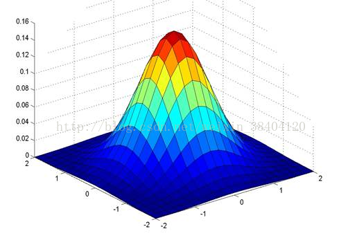

高斯函数对应的高斯核：
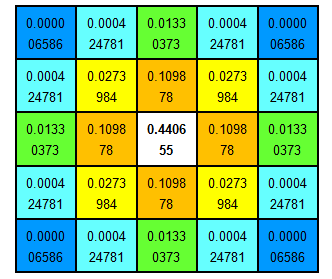


高斯核是圆对称的，在图片像素中展现出来的是一个正方形，其大小由高斯模板确定。卷积的结果使原始像素值有最大的权重，距离中心越远的相邻像素值权重也越小。


> 高斯模糊与“尺度空间表达”的关系？

“尺度空间表达”指的是不同高斯核所平滑后的图片的不同表达，意思就是：原始照片的分辨率，和经过不同高斯核平滑后的照片的分辨率是一样的。但是，对于计算机来说，不同模糊程度，照片“看”上去的样子就不一样了。高斯核越大，图片“看”上去就越模糊。

那么，图片的模糊与找特征点有关系吗？

计算机没有主观意识去识别哪里是特征点，它能做的，只是分辨出变化率最快的点。彩色图是三通道的，不好检测突变点。需要将RGB图转换为灰度图，此时灰度图为单通道，灰度值在0~255之间分布。

无论人眼观测照片的距离有多远，只要能辨认出物体关键的轮廓特征，那就可以大致知道图像所表达的信息。计算机也一样，高斯卷积之后，图像虽然变模糊了。但是整体的像素没有变，依然可以找到灰度值突变的点。

而这些点，就可以作为候选特征点了，后期再进一步减少点的数量，提高准确率即可。


# 金字塔多分辨率表达-降采样
这个比较好理解，若对一张图片进行降采样，其像素点就会减少，图片尺寸也会随之变小。那么给人的感觉就好比一个金字塔。

**图像金字塔化**的步骤：就是先进行图像平滑(高斯模糊)，再进行降采样，根据降采样率不同，所得到一系列尺寸逐渐减小的图像。

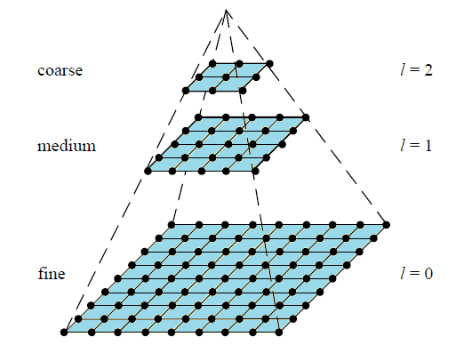

两种表达的不同之处在于：

- “尺度空间表达”在所有尺度上具有相同分辨率，而“图像金字塔化”在每层的表达上分辨率都会减少固定比率。
- “图像金字塔化”处理速度快，占用存储空间小，而“尺度空间表达”刚好相反。

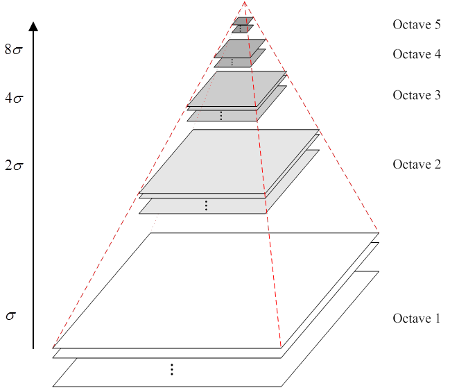
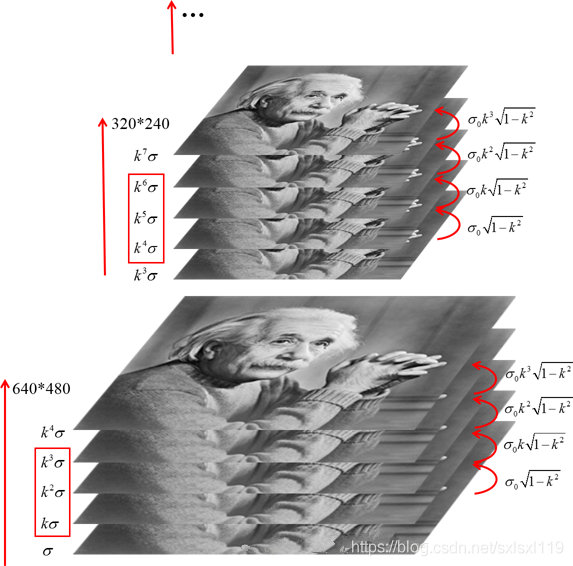


# LOG（Laplassian of Gaussian）

如上所述， “尺度空间表达”和 “图像金字塔化”各有各的优势。那么将两者融合起来的话，就得到了LOG图像（高斯拉普拉斯变换图像）。其步骤是：先将照片降采样，得到了不同分辨率下的图像金字塔。再对每层图像进行高斯卷积。这样一来，原本的图像金字塔每层只有一张图像，而卷积后，每层又增加了多张不同模糊程度下的照片。

然而，LOG图像还不是我们想要的，我们做那么多就是为了更好地获取特征点，所以还需要对LOG图像再进一步地优化。所以，DOG图像横空出世！！


# DOG（Difference of Gaussian）
构造高斯差分图像的步骤是：在获得LOG图像后，用其相邻的图像进行相减，得到所有图像重新构造的金字塔就是DOG金字塔。

图左边是LOG图像，图右边是DOG图像
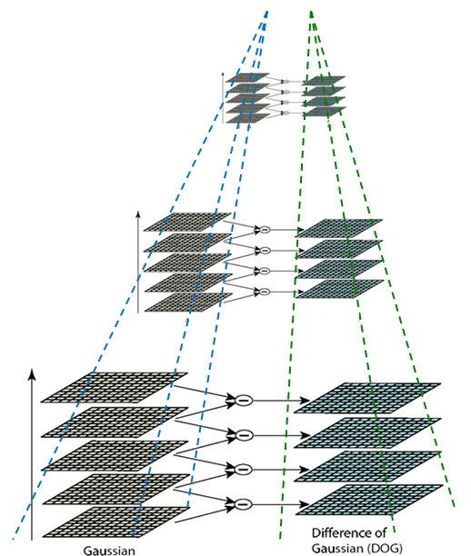

当得到DOG金字塔后，我们接下来要做的是寻找DOG极值点。每个像素点与其周围的像素点比较，当其大于或者小于所有相邻点时，即为极值点。

比如说，如下图所示，以x点为检测点，那么其周围的点，除了同层所包围的8个绿点外，还有上一层的9个点与下一层的9个点。

# DOG局部极值点
## 寻找极值点
当得到DOG金字塔后，我们接下来要做的是寻找DOG极值点。每个像素点与其周围的像素点比较，当其大于或者小于所有相邻点时，即为极值点。

比如说，如下图所示，以黄点为检测点，那么其周围的点，除了同层所包围的8个绿点外，还有上一层的9个点与下一层的9个点。

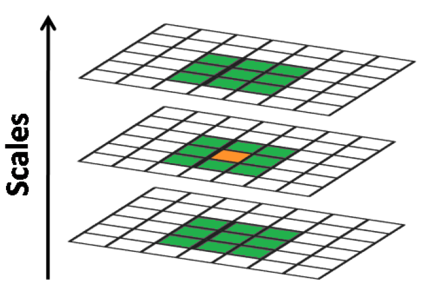


## 极值点精确定位

而我们找的的极值点是在高斯差分之后所确定下来的，那么其是属于离散空间上的点，不一定是真正意义上的极值点。

我们需用用到一条曲线来进行拟合。

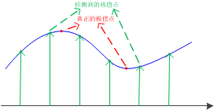

离散转换为连续，我们会想到泰勒展开式：
$$\begin{aligned}
    D(X)=D+\frac{\partial D^T}{\partial X}X+\frac{1}{2}X^T\frac{\partial^2 D}{\partial X^2}X
\end{aligned}$$

则极值点为
$$\begin{aligned}
    \widetilde X=(x,y,\sigma)^T
\end{aligned}$$

## 去除边缘影响
到这一步，得到的极值点是比较精确了，但不够准确。有些极值点不是我们想要的，当中就有一大部分是边缘区域产生的极值点。因为物体的边缘轮廓在灰度图中，存在着灰度值的突变，这样的点在计算中就被“误以为”是特征值。

仔细分析，边缘区域在纵向上灰度值突变很大，但是横向上的变化就很小了。好比你用黑笔在白纸上水平画一条线段。垂直方向看，黑色线与白色区域的突变很大。但是水平方向看时，黑色线上某一点的水平临近点仍然是黑点，突变程度非常小。

由于这一特殊性质，我们想到了Hessian矩阵，海塞矩阵是用来求曲率的，可以以函数的二阶偏导为元素，构成一个$2\times 2$的矩阵$H$
$$\begin{aligned} 
    H(x,y)=
    \begin{bmatrix}
        D_{xx}(x,y) & D_{xy}(x,y) \\
        D_{xy}(x,y) & D_{yy}(x,y)
    \end{bmatrix}
    \tag{1-1}  
\end{aligned}$$

> Harris角点检测算法

# 方向赋值
经过Harris角点检测算法之后，基本上得到了我们想要的精确特征点了。接下来我们就要求它们的方向。

在DOG 金字塔中，有很多层高斯模糊后的图像。在此，我们对其中一张图像的处理进行说明。当我们精确定位关键点后，需要找到该特征点对应的尺度值$σ$，根据这一尺度值，将对应的高斯图像的关键点进行有限差分，以$3×1.5σ$为半径的区域内图像梯度的幅角和幅值，得到：
$$\begin{aligned} 
    m(x,y)=\sqrt{[L(x+1,y)-L(x-1,y)]^2+[L(x,y+1)-L(x,y-1)]^2}
\end{aligned}$$
$$\begin{aligned} 
    \theta(x,y)=\arctan(\frac{L(x,y+1)-L(x,y-1)}{L(x+1,y)-L(x-1,y)})
\end{aligned}$$

然后利用直方图统计领域内像素对应的梯度和幅值：梯度方向角为横轴刻度，取45度为一个单位，那么横轴就有8个刻度；纵轴是对应梯度的幅值累加值。

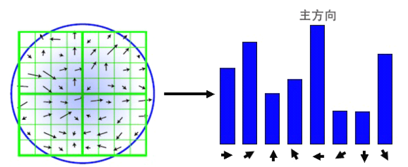

取幅值最高的方向为主方向。有的时候，会出现第二峰值，因为有较多的关键点是多方向的。如果直接把它忽略掉不加以考虑的话，最后对匹配精度的影响还是蛮大的。

所以，为了匹配的稳定性，我们将超过峰值能量的百分之80的方向，称为辅方向。


# 关键点描述
## 确定描述子采样区域
到了这里，我们就已经得到赋值后的SIFT特征点了，其包含了位置，尺度，方向的信息。

接下来的要做的是：关键点的描述，即用一组向量将关键点描述出来。

SIFI 描述子$h(x, y,θ)$是对特征点附近邻域内高斯图像梯度统计结果的一种表示，它是一个三维的阵列，但通常将它表示成一个矢量。矢量是通过对三维阵列按一定规律进行排列得到的。特征描述子与特征点所在的尺度有关，因此，对梯度的求取应在特征点对应的高斯图像上进行。

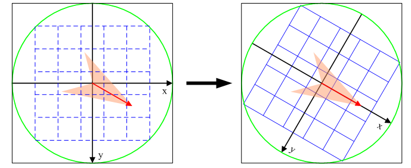

# 生成描述子
为了保证特征矢量具有旋转不变性，需要以特征点为中心，将特征点附近邻域内$(m\sigma(B_p+ 1)\sqrt{2} \times m\sigma(B_p+ 1)\sqrt{2})$图像梯度的位置和方向旋转一个方向角$θ$，即将原图像x轴转到与主方向相同的方向。

旋转公式如下：
$$\begin{aligned} 
    \begin{bmatrix}
        x^` \\
        y^`
    \end{bmatrix}
    =
    \begin{bmatrix}
        \cos\theta & -\sin\theta \\
        \sin\theta & \cos\theta
    \end{bmatrix}
    \begin{bmatrix}
        x \\
        y 
    \end{bmatrix}
\end{aligned}$$

在特征点附近邻域图像梯度的位置和方向旋转后，再以特征点为中心，在旋转后的图像中取一个$mσB_p \times mσB_p$大小的图像区域。并将它等间隔划分成$B_p \times B_p$个子区域，每个间隔为$mσ$像元。

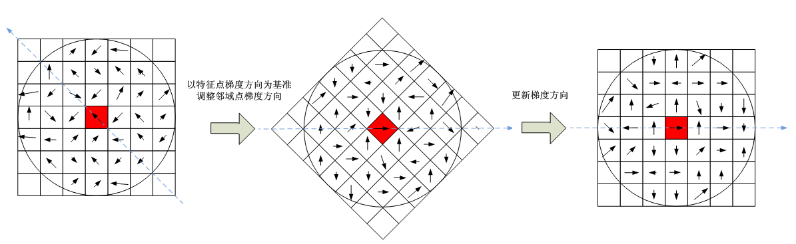

到这里，有人会问：旋转过程中，中图和右图为什么每个像素点的方向不一样？其实，你要明确一点，你所选的小区域，是关键点旋转后的小区域，右图的区域跟旋转前的区域不一样了，右图是重新选取得区域，但是区域大小没变。

# 生成特征匹配点
在每子区域内计算8个方向的梯度方向直方图，绘制每个梯度方向的累加值，形成一个种子点。与求特征点主方向时有所不同，此时，每个子区域的梯度方向直方图将0°~360°划分为8个方向范围，每个范围为45°，这样，每个种子点共有8个方向的梯度强度信息。由于存在4X4（Bp X Bp）个子区域，所以，共有4X4X8=128个数据，最终形成128维的SIFT特征矢量。同样，对于特征矢量需要进行高斯加权处理，加权采用方差为mσBp/2的标准高斯函数，其中距离为各点相对于特征点的距离。使用高斯权重的是为了防止位置微小的变化给特征向量带来很大的改变，并且给远离特征点的点赋予较小的权重，以防止错误的匹配。

在最后，对特征向量进行归一化处理，去除光照变化的影响。

 
# 使用特征检测器
Opencv提供FeatureDetector实现特征点检测。

最后把所检测到的特征点放置在一个容器中，再进行后续的图像匹配工作。

至此，SIFT特征匹配算法讲解结束。


# 代码部分
## OpenCV 函数
```cpp
CV_WRAP static Ptr<SIFT> create(
    int     nfeatures = 0, 
    int     nOctaveLayers = 3,
    double  contrastThreshold = 0.04, 
    double  edgeThreshold = 10,
    double  sigma = 1.6
);
```
- `nfeatures`
  - The number of best features to retain. The features are ranked by their scores (measured in SIFT algorithm as the local contrast) 
  - 保留的最佳特征的数量。特征按照得分进行排序（以 SIFT 算法作为局部对比度进行测量）

- `nOctaveLayers`
  - The number of layers in each octave. 3 is the value used in D. Lowe paper. The number of octaves is computed automatically from the image resolution.
  - 高斯金字塔的最小层级数。在 `D. Lowe` 的论文中使用的数值是 3 。octave 的数量是从图像分辨率中自动计算得出
  - > 八度(octave) 简单地说八度就是在特定尺寸(长宽)下，经不同高斯核模糊的图像的集合。八度的集合是高斯金字塔。

- `contrastThreshold`
  - The contrast threshold used to filter out weak features in semi-uniform (low-contrast) regions. The larger the threshold, the less features are produced by the detector.
  - 对比度阈值用来过滤掉弱特征的
  - @note The contrast threshold will be divided by nOctaveLayers when the filtering is applied. When nOctaveLayers is set to default and if you want to use the value used in D. Lowe paper, 0.03, set this argument to 0.09.


- `edgeThreshold`
  - The threshold used to filter out edge-like features. Note that the its meaning is different from the contrastThreshold, i.e. the larger the edgeThreshold, the less features are filtered out (more features are retained).

- `sigma`
  - The sigma of the Gaussian applied to the input image at the octave \#0. If your image is captured with a weak camera with soft lenses, you might want to reduce the number.
  - $\sigma$, 高斯输入层级， 如果图像分辨率较低，则可能需要减少数值

```cpp
CV_WRAP virtual void detect( 
  InputArray image,
  CV_OUT std::vector<KeyPoint>& keypoints,
  InputArray mask=noArray() 
);
```
@brief Detects keypoints in an image (first variant) or image set (second variant).
- `image` Image.
- `keypoints` The detected keypoints. In the second variant of the method keypoints[i] is a set of keypoints detected in images[i] .
- `mask` Mask specifying where to look for keypoints (optional). It must be a 8-bit integer matrix with non-zero values in the region of interest.

# 参考资料
- [OpenCV-图像特征提取算法5_SIFT](https://blog.csdn.net/sxlsxl119/article/details/84814580) 
- [SIFT特征匹配算法介绍——寻找图像特征点的原理](https://blog.csdn.net/weixin_38404120/article/details/73740612)
- [SIFT算法](https://blog.csdn.net/lyl771857509/article/details/79675137)

[回到目录](#导航)